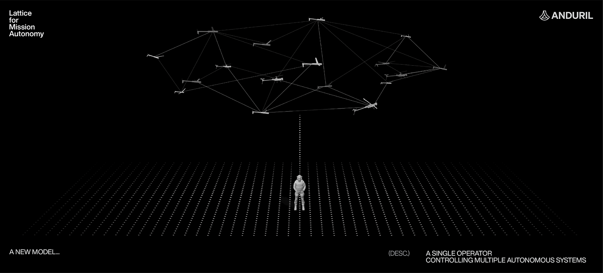

# Anduril Industries

 

## Roots 
Anduril Industries was founded in 2017 by Palmer Luckey and Trae Stephens. The idea took root when Stephens became interested in the samll field of defense startups. Soon he talked to Palmer Luckey about his idea, the two began to recruit others to initate the successful company. The other men included Brian Schimpf, Matt Grimm, and Joe Chen. Their first investment was a whooping $17.5 million through Founders Fund. 


## Business 
At Anduril, they believe that one of the biggest threats to the capabilites of the US defense was their lack of technological advancement in the DoD. 

> Mission 
>>"Transforming defense capabilities with advanced technology."

The startup is looking to solve that issue. They would like to update and bring military capabilites to a new level with the most recent technology to the USA and their allies. Not only do they promise to meet this demand in the market, they also promise to deliver it to the DoD in a timely manner. 

```
     "Anduril puts products ahead of process and builds technology to bring the United States and partners quantum leaps ahead in capability." 
```

The biggest advantage of Anduril is their software specialization mixed with their knowledge of hardware. Most of the competitors of the startup are stuck with only innovating hardware with little consideration to the software. 

  

"... Anduril’s core system is Lattice OS, an autonomous sensemaking and command & control platform that serves as the core platform for our suite of capabilities." 
~ The company has on their mission statement.

## Software Defense

### Innovation
The field of software defense is relatively new. Lockheed Martin and Raytheon are well established companies that have been around for some time. Because of their age, they have created connections and kept the field of defense relatively small. Anduril came into the game introducing a non-traditional concept of integratting AI and other software development into hardware. AI offers many benefits to the DoD for the simple reason that it requires less man power to be present at all. AI takes over the ability to make decisions quickly and when needed without the human error. Even though there are other companies that have followed the lead of Anduril, like Rebellion Defense, they have not been able to meet the demands of the market as well or at all.

<video src="Mini_trim_video.mp4" controls title="Title"></video>


https://github.com/Lpzai2/ai-case-study/assets/148823473/1f80ea8e-0be4-4a7c-a139-9fa2828921f8


## In Action
Because this startup is one of its kind, the impacts has been staggering. They have already signed defense contracts with the US. One of their major achievements is implementing the Sentry Tower Deployment which helps Border Patrol officers monitor the border between USA and Mexico. In areas where the officers do not have enough personel, Anduril has built towers that do not disturb the environment, solar powered, and keeps continue survelliance of the region that they have selected.


Most defense contractor startups measure success by the amount of contracts they can aquire from the US government, however, their real success can be measured by the growing funding that they keep on receiving and therefore the continous creation of cutting edge technology. There are very few if any startups and Anduril is the only one that can invent, finalize, and deliver the product needed for the US defense to continue to be a global power. 

## Dreaming
In a crazy world, where Anduril finds themselves stuck in the next big thing to create, I have a small idea that could be taken into consideration. It is great that they can continue to develop new technology that can continue to compete with other nations. Nevertheless, it might be worth the time to invest in a new technology that can control other. For instance, if this new technology could be in a drone, take in its environment without being detected, and be able to stop other software from working without affecting the drones it could be something to gain some time or information. Going a little further, building an AI that would be able to decide which technology to copy or delete might make it more effective. Crazy idea, but it would seperate this company from any other because it would have the power to intervene with the software, hardware, or technology of other nations. 


## References
- https://miro.medium.com/v2/resize:fit:1400/1*8sbjmq10ITX6hv-5A8-zkw.png

- https://s.ipvm.com/uploads/embedded_image/4fa16185bd1b576f681e8cac15379a0bc79ef4a0e112e1d14ad24e48b037efb0/028a8f51-2a8a-4e9f-90fa-d3673b5901a9.webp
- https://research.contrary.com/reports/anduril?head=;;competition
- https://www.vox.com/recode/23507236/inside-disruption-rebellion-defense-washington-connected-military-tech-startup
- https://www.forbes.com/companies/anduril-industries/?list=ai50&sh=281d0c42e083
- https://cdn.sanity.io/files/z5s3oquj/production/b7f8f4a89e564305b8c810113d7bf71d445b1419.mp4
-https://www.anduril.com/images/anduril-logo-white-on-black.png

